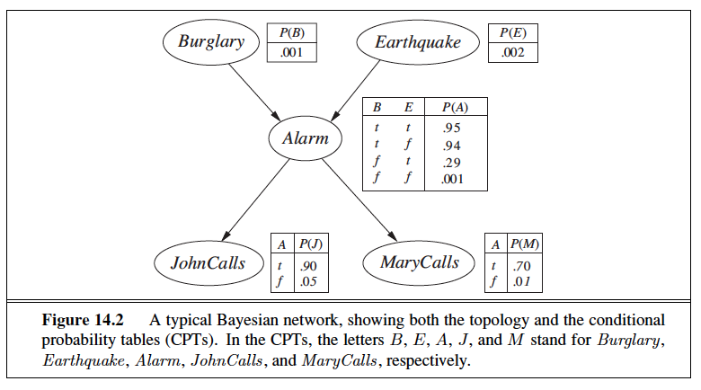

# Inference in Bayesian Networks Alarm Network

Refer to "Inference in Bayesian Networks Statement.pdf" and the following Image file.

python3 PA3.py "[< N1,V1 >,...,< NN,VN >]" "[NQ1,NQM]" 

Assumptions:

1.	Different numbers of sample size are set in list as sampleSizes = 	(10,50,100,200,500,1000,10000). 
	Program enumerates through each element of the list and runs each sampling
	for that value as sample size.

2.	Average of the inferred probability, for each sampling algorithm, for an event asked in questions is taken care by Loop at line number#159.

3.	Rejection Sampling will keep samples consistent with evidence only. 
	e.g Given 1000 as a sample size, Rejection Sampling may return less number of samples depending upon the evidence variable values.

4.	likelihood weighted samples are all the sample which may not be consistent 	with the
	evidence variable, so the probability of the event would be as 	follows:

	(#sample consistent with query and evidence variables)/(#sample consistent 	with only evidence variables)

	the same is used for prior and rejection sampling.

